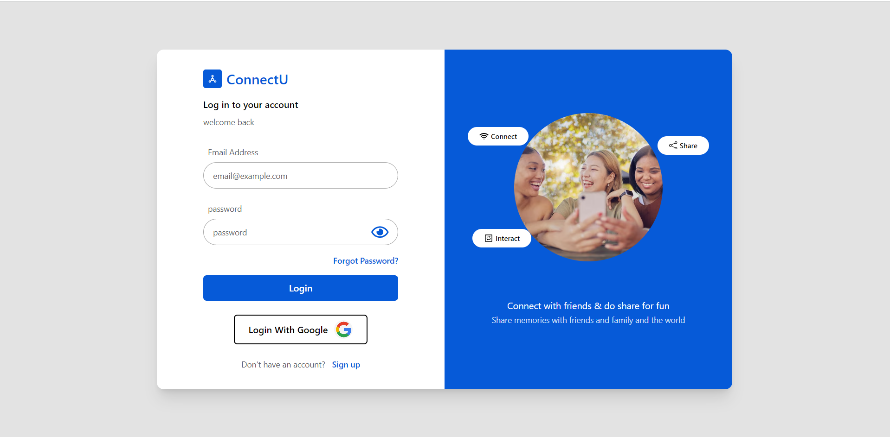

# Connect-U

**[A Social Media Platform (Link to Visit)](https://uconnect.netlify.app "Visit")**

## Table of Contents
- [Introduction](#introduction)
- [Features](#features)
- [Appearance](#appearance)
- [Technology Stack (MERN)](#technology-stack-mern)
- [Getting Started](#getting-started)
  - [Prerequisites](#prerequisites)
  - [Installation](#installation)
<!-- - [Usage](#usage)
  - [Creating a Post](#creating-a-post)
  - [Viewing Posts](#viewing-posts)
  - [Interacting with Posts](#interacting-with-posts) -->
- [Contributing](#contributing)
- [License](#license)

## Introduction

ConnectU is a social media web application built for connecting diverse users and enabling online interactions. It allow users interaction, posting text, images, or multimedia content. The application is built using the ReactJS for frontend, and NodeJS and ExpressJS for backend and uses mongoDB as database.  

## Features

List of key features of the application:

- User registration and authentication
- Creating and editing user profiles
- Posting text, images, or multimedia content
- Like and comment functionality
- Feed displaying user posts
- Send and receive freind request
- Search functionality
- Light theme and dark theme
- Suitable for mobile view
- Login and Sign up with Google

## Appearance

## Technology Stack (MERN)

- **React:** JavaScript library for building the user interface and front-end components.
- **Redux:** State management library for managing and centralizing the application's state.
- **Node.js:** JavaScript runtime for executing server-side code and managing dependencies.
- **Express.js:** Web application framework for building the backend server.
- **MongoDB:** NoSQL database for storing user data, posts, and other information.

## Getting Started

**Instructions on how to set up the project locally.**

### Prerequisites

List of software, tools, or dependencies required to run in local machine:

- Node.js (version >= 16.X.X)
- MongoDB Compass (version >= 6.X.X) or MongoDB Atlas
- A code editor such as VS Code

### Installation

1. Clone the repository: `git clone https://github.com/iabhinav15/ConnectU.git`
2. Navigate to front-end of project directory: `cd ConnectU/frontend`
3. Navigate to back-end project directory: `cd ConnectU/server`
4. Install dependencies for both: `npm install`
5. Configure the environment variables for both directories by creating `.env` file.
6. Start the front-end and back-end of application uisng: `npm start`

<!-- ## Usage

Explain how users can use the different features of your social media platform.

### Creating a Post

Guide users on how to create a post, including any required fields or formats.

### Viewing Posts

Explain how users can view posts, whether it's through a news feed, profiles, or other means.

### Interacting with Posts

Detail how users can like and comment on posts. -->

## Contributing

Contributions are welcome! If you find any bugs or have suggestions for new features, feel free to open an issue or submit a pull request.

## License

This project is released under the ISC License. Feel free to use and modify the code for your own projects.
